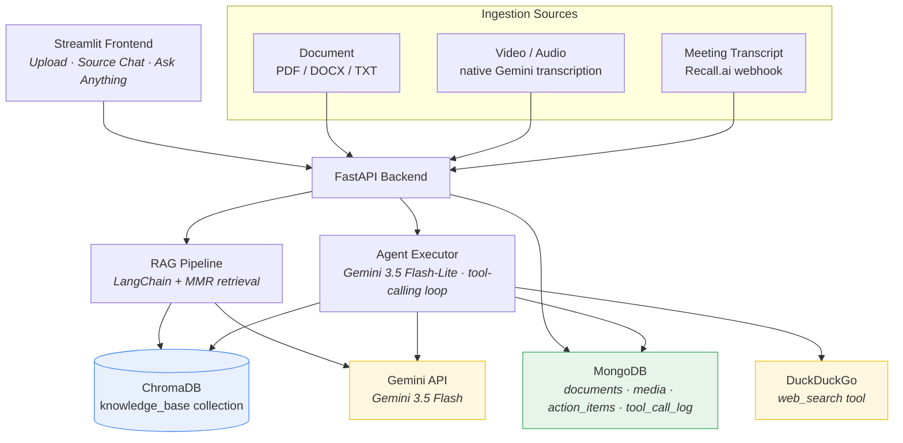
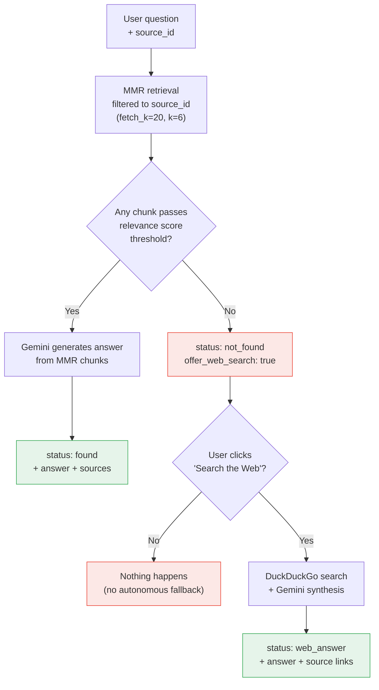
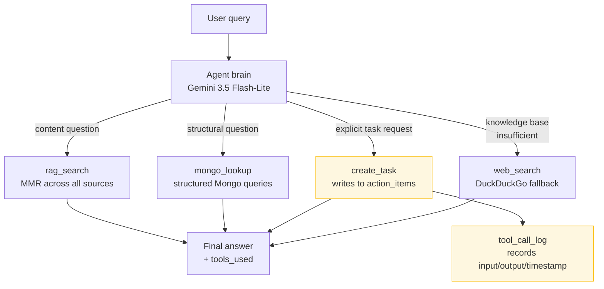

# Agentic RAG Assistant

A multi-source RAG system that ingests documents, videos, and meeting transcripts into a unified knowledge base, answers questions grounded in that content, and includes an autonomous agent layer with tool-calling, gated web search, and an auditable write tool for task creation.

Built with **FastAPI**, **Streamlit**, **LangChain**, **ChromaDB**, **MongoDB**, and the **Gemini API**.

---

## Table of contents

- [Features](#features)
- [Architecture](#architecture)
- [RAG chat flow](#rag-chat-flow-per-source)
- [Agent flow](#agent-flow-ask-anything)
- [Tech stack](#tech-stack)
- [Setup](#setup)
- [API reference](#api-reference)
- [Design decisions](#design-decisions)
- [Known limitations](#known-limitations)
- [Lessons learned](#lessons-learned)
- [Roadmap](#roadmap)

---

## Features

- **Multi-source ingestion** — PDF, DOCX, TXT documents; video/audio via Gemini's native multimodal transcription; meeting transcripts via a Recall.ai-style webhook — all converging into one searchable knowledge base.
- **Per-source RAG chat** — ask questions scoped to a single document, video, or meeting, with answers grounded strictly in that source.
- **Gated web-search fallback** — when a question can't be answered from the source, the system offers (never auto-fires) a web search via DuckDuckGo.
- **Autonomous agent ("Ask Anything")** — a LangChain tool-calling agent that reasons across your *entire* knowledge base, using four tools: `rag_search`, `mongo_lookup`, `create_task`, and `web_search`.
- **Auditable write tool** — every task the agent creates is logged with its exact input/output/timestamp, and the agent is explicitly instructed never to create tasks speculatively.
- **MMR retrieval** — diverse, non-redundant chunk selection via Maximal Marginal Relevance, tuned for accuracy without the extra LLM-call cost of contextual compression (see [Design decisions](#design-decisions)).
- **Config-driven models** — every Gemini model name is an environment variable, not a hardcoded string, so the app survives model deprecations with a one-line `.env` change.

---

## Architecture



All three ingestion sources — documents, videos, and meeting transcripts — are normalized to plain text and pushed through the **same** chunk → embed → store pipeline, distinguished only by a `source_type` metadata field (`document`, `video`, or `meeting`). This is what lets a single chat endpoint answer questions about any of them interchangeably.

---

## RAG chat flow (per-source)

This is the endpoint behind the "Document/Video Chat" tab — deliberately **not agentic**. It never calls tools, never writes to the database, and only reaches the web on an explicit user click.



The relevance score check runs on raw Chroma similarity scores — no LLM call involved — so it costs nothing extra while still correctly distinguishing "this source doesn't cover that" from a forced, low-quality answer built from irrelevant chunks.

---

## Agent flow (Ask Anything)

This is the endpoint behind the "Ask Anything" tab — a genuine LangChain tool-calling agent with full autonomy to choose among four tools, reasoning across the *entire* knowledge base rather than one scoped source.



**Key design choices reflected in this flow:**
- The agent **is not** wired into per-source chat — it's a completely separate surface, so a user asking a scoped document question never accidentally triggers a database write.
- `create_task` is instructed to fire **only on explicit request**, and is the only tool that writes to `tool_call_log` — reads aren't logged, only consequential writes are.
- The agent will chain tools when useful (e.g. `mongo_lookup` to find a meeting, then `rag_search` to verify its content) rather than stopping at the first tool call.
- Tested against a fabricated entity name ("Monarch") not present anywhere in the ingested content — the agent correctly asked for clarification instead of hallucinating a task, rather than guessing.

---

## Tech stack

| Layer | Technology |
|---|---|
| Frontend | Streamlit |
| Backend | FastAPI |
| Orchestration | LangChain |
| Vector store | ChromaDB (MMR retrieval) |
| Structured storage | MongoDB |
| LLM | Gemini API (chat + embeddings + multimodal transcription) |
| Web search | DuckDuckGo (`ddgs`) |
| Live meetings | Recall.ai webhook (tested via mock payload) |

---

## Setup

### Prerequisites
- Python 3.11+
- A Gemini API key ([aistudio.google.com](https://aistudio.google.com))
- A MongoDB connection string (Atlas free tier works fine)

### Installation

```bash
git clone <your-repo-url>
cd agentic-rag-app
python -m venv .venv
.venv\Scripts\Activate.ps1   # Windows PowerShell
pip install -r requirements.txt
```

### Configuration

Copy `.env.example` to `.env` and fill in your values:

```
GEMINI_API_KEY=your_gemini_api_key
MONGODB_URI=your_mongodb_connection_string
CHROMA_PERSIST_DIR=./chroma_data
RECALL_API_KEY=

GEMINI_CHAT_MODEL=gemini-3.5-flash
GEMINI_LITE_MODEL=gemini-3.5-flash-lite
GEMINI_EMBEDDING_MODEL=models/gemini-embedding-001
```

> Model names are configurable specifically because Gemini's model lineup changes frequently — if a model gets deprecated, update `.env`, no code changes needed.

### Running

```bash
# Terminal 1 — backend
uvicorn backend.main:app --reload

# Terminal 2 — frontend
streamlit run frontend/app.py
```

Backend docs available at `http://127.0.0.1:8000/docs`. Frontend at `http://localhost:8501`.

---

## API reference

| Endpoint | Purpose |
|---|---|
| `POST /upload` | Ingest a document (PDF/DOCX/TXT) |
| `POST /upload/video` | Ingest a video/audio file via Gemini transcription |
| `POST /meetings/webhook` | Ingest a meeting transcript (Recall.ai-style payload) |
| `GET /sources` | List all ingested sources across documents and media |
| `POST /documents/{source_id}/chat` | Ask a question scoped to one source |
| `POST /documents/{source_id}/chat/web-search` | Explicit web-search fallback for that source |
| `POST /assistant/chat` | Agentic chat across the full knowledge base, with tool use |
| `GET /health` | Health check |

---

## Design decisions

**Why RAG-first with a gated web-search fallback, instead of a fully autonomous agent, for per-source chat?**
Predictability and trust matter more than flexibility for a "chat about this one document" UX. A user should always know whether an answer came from their own uploaded content or the open web — auto-triggering web search blurs that line and risks quietly mixing private content with unrelated internet results. The agent's full autonomy is reserved for a clearly separate "Ask Anything" surface.

**Why MMR without contextual compression?**
An earlier version layered a `ContextualCompressionRetriever` on top of MMR to trim each chunk to only its most relevant sentences. This worked, but cost one extra Gemini call *per retrieved chunk* — up to 6 additional calls for a single question, which made free-tier rate limits (as low as 15 requests/minute, 20/day depending on the model) unworkable for actual development and testing. MMR's diverse chunk selection already does most of the real work for a project where users ask direct questions about their own uploaded content; compression's marginal quality gain wasn't worth an 80%+ increase in API cost per question.

**Why is only `create_task` logged in `tool_call_log`, not `rag_search` or `mongo_lookup`?**
Read tools carry no lasting risk — a bad answer is visible immediately in the response. Write tools permanently change stored data, so if the agent ever misfires, there needs to be a forensic trail (exact input, output, and timestamp) to understand why. Logging every read would just add noise without adding safety value.

**Why does the agent ask for clarification instead of guessing on ambiguous requests?**
The system prompt explicitly instructs `create_task` to fire only on clear, explicit requests — never speculatively. This was validated by testing with a fabricated entity name not present in any ingested content; the agent correctly declined to create a task rather than hallucinating one.

---

## Known limitations

- **Tool-call argument extraction is phrasing-sensitive.** `create_task` reliably extracts the right assignee when the name directly follows "task for" (e.g. *"Create a task **for Priya** to..."*). Ambiguous phrasing (e.g. putting the name at the end of a long sentence) can cause the agent to misinterpret which entity is the assignee versus part of the task's subject matter. This is an inherent limitation of natural-language-to-structured-arguments extraction, not a bug specific to this implementation.
- **Per-source chat cannot take actions.** It's intentionally read-only (see Design decisions) — action requests ("create a task...") made in that tab will correctly return "not found" rather than silently failing or acting unexpectedly, but the messaging doesn't yet distinguish "genuinely off-topic" from "this tab can't perform actions, try Ask Anything instead."
- **Meeting ingestion is tested against a mocked Recall.ai payload**, not a live paid integration — the webhook handler is built against Recall.ai's documented payload structure but wasn't verified against a real account.
- **Relevance score threshold is a starting value**, tuned empirically rather than derived from a formal evaluation set — may need adjustment for different embedding distributions.

---

## Lessons learned

Building this surfaced a genuinely useful set of real-world integration issues, most stemming from how fast the Gemini and LangChain ecosystems have moved in 2025–2026:

- **Deprecated SDKs**: the original `google.generativeai` Python package was fully retired (Nov 2025) mid-build, requiring a migration to the new unified `google-genai` SDK with a different client pattern.
- **Deprecated model names**: `models/embedding-001` and later `gemini-2.5-flash-lite` both stopped being available mid-project — the fix was making every model name an environment variable rather than hardcoding it, so a deprecation is now a one-line `.env` change instead of a code change.
- **LangChain's 1.0+ restructuring**: several classes (`LLMChainExtractor`, `create_tool_calling_agent`, `AgentExecutor`) moved out of the core `langchain` package into `langchain_classic` — a recurring "ModuleNotFoundError → check the new package" pattern throughout the build.
- **In-memory vs. persisted Chroma**: an empty `CHROMA_PERSIST_DIR` env var silently caused Chroma to run in-memory, meaning all ingested data vanished on every backend restart — diagnosed by testing whether retrieval survived a restart, not just whether ingestion returned 200.
- **Retrieval "always returns something"**: dropping contextual compression removed an implicit relevance filter, causing genuinely off-topic questions to get answered from irrelevant chunks instead of correctly falling back to "not found." Fixed with a zero-cost similarity score threshold rather than reintroducing per-chunk LLM calls.

---

## Roadmap

- [ ] Live Recall.ai integration (currently mock-tested only)
- [ ] Automated test suite (pytest + FastAPI TestClient)
- [ ] Deployed demo (Streamlit Community Cloud + Render/Railway)
- [ ] UX distinction between "off-topic" and "this tab can't take actions" in per-source chat
- [ ] Evaluation set for tuning the relevance score threshold empirically

---

## License

MIT
